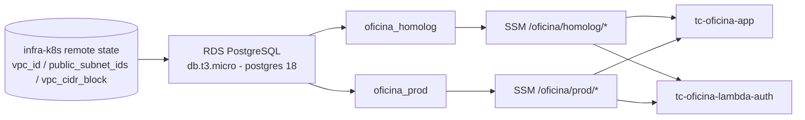

# tc-oficina-infra-db

Terraform da camada de dados do sistema da oficina mecânica — Tech Challenge FIAP SOAT,
Fase 3, grupo **Integradores**.

## Propósito ✱

Este repositório é responsável só pelo banco de dados gerenciado e pelos contratos que
expõe para o resto do sistema:

- Uma instância **RDS PostgreSQL** (`db.t3.micro`, engine `postgres` 18) com dois bancos
  lógicos: `oficina_homolog` e `oficina_prod`.
- Quatro parâmetros no **SSM Parameter Store** (`jwt-secret` e `database-url`, um par por
  ambiente) consumidos pela API da oficina e pela Lambda de autenticação por CPF.

Nenhum outro repositório lê o state Terraform deste repo — a integração acontece
inteiramente via SSM Parameter Store. Este repositório, por sua vez, lê o remote state do
`tc-oficina-infra-k8s` para descobrir em qual VPC/subnets criar o RDS, então **infra-k8s
precisa estar aplicado primeiro**.

## Tecnologias ✱

- Terraform ≥ 1.10 (CI/CD fixam 1.15.9; `use_lockfile` no backend S3 exige ≥ 1.10)
- Providers: `hashicorp/aws` (RDS, security group, SSM), `cyrilgdn/postgresql` (bancos
  lógicos dentro da instância), `hashicorp/random` (segredos JWT)
- Backend remoto: S3 (`tc-fiap-oficina-tfstate-512135631497`, key `fase-3/infra-db.tfstate`)
  com locking nativo (`use_lockfile`)
- GitHub Actions — CI (`fmt`/`validate`/`plan`) e CD (`apply`)

## Arquitetura deste repositório ✱



Dependência do remote state do `tc-oficina-infra-k8s` (mesmo bucket S3, key
`fase-3/infra-k8s.tfstate`):

```hcl
data "terraform_remote_state" "k8s" {
  backend = "s3"
  config = {
    bucket = "tc-fiap-oficina-tfstate-512135631497"
    key    = "fase-3/infra-k8s.tfstate"
    region = "us-east-1"
  }
}
```

### Parâmetros SSM publicados (contrato)

| Path | Tipo | Finalidade | Consumidor |
| --- | --- | --- | --- |
| `/oficina/homolog/jwt-secret` | SecureString | Segredo (64 chars) para assinar/validar o JWT do login por CPF | tc-oficina-app, tc-oficina-lambda-auth |
| `/oficina/homolog/database-url` | SecureString | Connection string Postgres do banco `oficina_homolog` | tc-oficina-app |
| `/oficina/prod/jwt-secret` | SecureString | Segredo (64 chars) para assinar/validar o JWT do login por CPF | tc-oficina-app, tc-oficina-lambda-auth |
| `/oficina/prod/database-url` | SecureString | Connection string Postgres do banco `oficina_prod` | tc-oficina-app |

### Trade-offs (conta AWS Academy)

- **RDS público** (`publicly_accessible = true`, security group libera 5432 para o CIDR da
  VPC e para `0.0.0.0/0`): não há bastion nem VPN no Learner Lab, e três consumidores
  precisam alcançar o banco pela internet — o provider `cyrilgdn/postgresql` durante o
  apply, os pipelines de CI/CD e a Lambda de autenticação (fora da VPC). Em produção real, o
  RDS ficaria só na VPC, com acesso via bastion/VPN.
- **Apply em duas fases:** o provider `postgresql` usa `aws_db_instance.main.address`, que
  só existe depois de criada a instância. Num state vazio, aplique
  `terraform apply -target=aws_db_instance.main` e depois `terraform apply`.
- **Sem recuperação de dados:** `skip_final_snapshot = true` e sem `backup_retention_period`
  — destruir a instância apaga tudo. Aceitável no sandbox acadêmico, não em produção.

Justificativa formal do PostgreSQL/RDS e o DER completo:
[`banco-de-dados.md`](https://github.com/FIAP-POS-TECH-SOFTWARE-ARCHITECTURE/tc-oficina-app/blob/main/docs/arquitetura/banco-de-dados.md);
topologia de instância única com dois bancos lógicos:
[ADR-004](https://github.com/FIAP-POS-TECH-SOFTWARE-ARCHITECTURE/tc-oficina-app/blob/main/docs/arquitetura/adrs/adr-004-ambientes-por-namespace-e-banco-logico.md).

## Como executar localmente ✱

Pré-requisitos:

1. Sessão ativa do AWS Academy Learner Lab, credenciais exportadas no ambiente
   (`AWS_ACCESS_KEY_ID`, `AWS_SECRET_ACCESS_KEY`, `AWS_SESSION_TOKEN`).
2. `TF_VAR_db_password` definido com a senha do usuário `oficina` (mesmo valor do secret
   `TF_VAR_DB_PASSWORD` no GitHub Actions — o GitHub força nome de secret maiúsculo).
3. `tc-oficina-infra-k8s` já aplicado (para o `data "terraform_remote_state" "k8s"` existir).
4. Bucket de state S3 acessível — se não existir, o CD tem um passo de bootstrap; localmente,
   criar manualmente ou reaproveitar.

```bash
cp terraform.tfvars.example terraform.tfvars   # nunca commitar o arquivo preenchido
export TF_VAR_db_password="<mesma senha do secret TF_VAR_DB_PASSWORD>"

terraform init
terraform plan
terraform apply
```

Validar a conexão depois do apply:

```bash
psql "postgresql://oficina:<senha>@<endpoint>:5432/oficina_homolog"
```

## Deploy ✱

- **CI** (`.github/workflows/ci.yml`): em todo PR para `main` e `develop`. Roda
  `terraform fmt -check`, `terraform validate` (sem backend, não depende de AWS) e um
  `terraform plan` best-effort — se as credenciais Academy estiverem expiradas, o plan falha
  de forma não bloqueante e só `fmt`/`validate` são obrigatórios.
- **CD** (`.github/workflows/cd.yml`): no merge de PR em `main` (ou `workflow_dispatch`).
  Antes do `terraform init`, garante que o bucket de state S3 exista (a conta Academy pode
  resetar entre sessões), depois `terraform apply -auto-approve`.

Como a infraestrutura de dados é única (serve homolog e prod ao mesmo tempo), o CD roda só
no merge em `main`. Deploy manual de contingência: o bloco de "Como executar localmente"
acima, com o lab ativo — o state é o mesmo do CI.

Secrets necessários: `AWS_ACCESS_KEY_ID`, `AWS_SECRET_ACCESS_KEY`, `AWS_SESSION_TOKEN`
(Learner Lab, rotativos) e `TF_VAR_DB_PASSWORD`.

## Links ✱

- **Deploy ativo:** endpoint do RDS = output do `terraform apply` / console RDS (conta AWS
  Academy — disponível sob demanda, com o lab ligado). Não há endpoint HTTP neste
  repositório.
- **Swagger / Collection:** não se aplica (repositório de infraestrutura). Swagger e
  collections ficam no `tc-oficina-app` e no `tc-oficina-lambda-auth`.
- **Documentação arquitetural:** [`docs/arquitetura/`](https://github.com/FIAP-POS-TECH-SOFTWARE-ARCHITECTURE/tc-oficina-app/tree/main/docs/arquitetura)
  no `tc-oficina-app` — em especial [`banco-de-dados.md`](https://github.com/FIAP-POS-TECH-SOFTWARE-ARCHITECTURE/tc-oficina-app/blob/main/docs/arquitetura/banco-de-dados.md)
  e [ADR-004](https://github.com/FIAP-POS-TECH-SOFTWARE-ARCHITECTURE/tc-oficina-app/blob/main/docs/arquitetura/adrs/adr-004-ambientes-por-namespace-e-banco-logico.md).
- **Demais repositórios da solução:**
  [`tc-oficina-app`](https://github.com/FIAP-POS-TECH-SOFTWARE-ARCHITECTURE/tc-oficina-app) ·
  [`tc-oficina-lambda-auth`](https://github.com/FIAP-POS-TECH-SOFTWARE-ARCHITECTURE/tc-oficina-lambda-auth) ·
  [`tc-oficina-infra-k8s`](https://github.com/FIAP-POS-TECH-SOFTWARE-ARCHITECTURE/tc-oficina-infra-k8s)

## Grupo Integradores

| Nome | RM |
| --- | --- |
| Lucas Gardini Dias | 372237 |
| Thiago Aio | 372238 |
