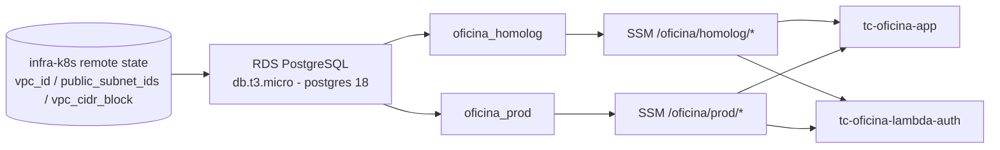

# tc-oficina-infra-db

Terraform da camada de dados do sistema da oficina mecânica (Tech Challenge FIAP SOAT, grupo Integradores). Provisiona uma instância RDS PostgreSQL compartilhada entre os ambientes de homologação e produção, e publica os parâmetros que as aplicações consomem para se conectar.

## Propósito

Este repositório é responsável só pelo banco de dados gerenciado e pelos contratos que expõe para o resto do sistema:

- Uma instância RDS PostgreSQL (`db.t3.micro`, engine `postgres` v18) com dois bancos lógicos: `oficina_homolog` e `oficina_prod`.
- Quatro parâmetros no SSM Parameter Store (`jwt-secret` e `database-url`, um par por ambiente) usados pela API da oficina e pela Lambda de autenticação.

Nenhum outro repositório lê o state Terraform deste repo — a integração acontece inteiramente via SSM Parameter Store.

## Tecnologias

- Terraform >= 1.9
- Providers: `hashicorp/aws` (RDS, security group, SSM), `cyrilgdn/postgresql` (criação dos bancos lógicos dentro da instância), `hashicorp/random` (geração dos segredos JWT)
- Backend remoto: S3 (`tc-fiap-oficina-tfstate-076155200589`, chave `fase-3/infra-db.tfstate`) com locking nativo (`use_lockfile`)
- GitHub Actions para CI (fmt/validate/plan) e CD (apply)

## Dependência: infra-k8s precisa rodar primeiro

Este repositório lê o state remoto do repositório `tc-oficina-infra-k8s` (mesmo bucket S3, chave `fase-3/infra-k8s.tfstate`) para obter `vpc_id`, `public_subnet_ids` e `vpc_cidr_block`. Sem esse repositório já aplicado, o `terraform plan`/`apply` aqui falha.

```
data "terraform_remote_state" "k8s" {
  backend = "s3"
  config = {
    bucket = "tc-fiap-oficina-tfstate-076155200589"
    key    = "fase-3/infra-k8s.tfstate"
    region = "us-east-1"
  }
}
```

## Diagrama



## Parâmetros SSM publicados

| Path | Tipo | Finalidade | Consumidor |
| --- | --- | --- | --- |
| `/oficina/homolog/jwt-secret` | SecureString | Segredo (64 chars aleatórios) para assinar/validar JWT emitido no login por CPF | tc-oficina-app, tc-oficina-lambda-auth |
| `/oficina/homolog/database-url` | SecureString | Connection string Postgres do banco `oficina_homolog` | tc-oficina-app |
| `/oficina/prod/jwt-secret` | SecureString | Segredo (64 chars aleatórios) para assinar/validar JWT emitido no login por CPF | tc-oficina-app, tc-oficina-lambda-auth |
| `/oficina/prod/database-url` | SecureString | Connection string Postgres do banco `oficina_prod` | tc-oficina-app |

## Trade-off: RDS público (ambiente Academy)

A instância é criada com `publicly_accessible = true` e o security group libera a porta 5432 tanto para o CIDR da VPC quanto para `0.0.0.0/0`:

```
# Postgres a partir da VPC (pods do EKS)
ingress {
  from_port   = 5432
  to_port     = 5432
  protocol    = "tcp"
  cidr_blocks = [data.terraform_remote_state.k8s.outputs.vpc_cidr_block]
}

# TRADE-OFF ACADEMY: acesso externo para migração via pipeline,
# provider postgresql e Lambda fora da VPC.
ingress {
  from_port   = 5432
  to_port     = 5432
  protocol    = "tcp"
  cidr_blocks = ["0.0.0.0/0"]
}
```

Isso existe porque, na conta de sandbox da AWS Academy, não há bastion host nem VPN disponível, e três consumidores precisam alcançar o banco diretamente pela internet:

- o provider `cyrilgdn/postgresql`, que roda durante o `terraform apply` (na máquina local ou no runner do GitHub Actions) para criar os bancos lógicos;
- os pipelines de CI/CD;
- a Lambda de autenticação, que roda fora da VPC do EKS.

Em uma implantação de produção real, o correto seria manter o RDS acessível somente dentro da VPC, com acesso externo restrito a um bastion host ou VPN.

## Trade-off: apply em duas fases e ausência de recuperação de dados

O provider `cyrilgdn/postgresql` é configurado usando `aws_db_instance.main.address`, ou seja, um atributo que só existe depois que o RDS é criado. Isso significa que um `terraform apply` totalmente do zero (state vazio) pode falhar com um erro do tipo "the configuration for provider ... depends on values that cannot be determined until apply" ao tentar criar os bancos lógicos e os parâmetros SSM na mesma execução. Quando isso acontecer, aplique em duas etapas:

```bash
terraform apply -target=aws_db_instance.main
terraform apply
```

O primeiro comando cria só a instância RDS; o segundo, com o endereço já conhecido, cria o restante (bancos lógicos e parâmetros SSM) normalmente.

Além disso, a instância usa `skip_final_snapshot = true` e não define `backup_retention_period`, ou seja, não há snapshot final nem backups automáticos: destruir a instância apaga todos os dados sem possibilidade de recuperação. Isso é aceitável para este ambiente de sandbox acadêmico, mas não seria aceitável em produção real.

## Pré-requisitos para aplicar localmente

1. Sessão ativa do AWS Academy Learner Lab com credenciais atualizadas (`AWS_ACCESS_KEY_ID`, `AWS_SECRET_ACCESS_KEY`, `AWS_SESSION_TOKEN`).
2. Variável de ambiente `TF_VAR_db_password` definida com a senha do usuário `oficina` (o mesmo valor guardado como secret `TF_VAR_db_password` no GitHub Actions).
3. Repositório `tc-oficina-infra-k8s` já aplicado, para que o state remoto usado pelo `data "terraform_remote_state" "k8s"` exista no bucket.
4. Bucket de state S3 (`tc-fiap-oficina-tfstate-076155200589`) acessível — se não existir, o pipeline de CD tem um passo de bootstrap que cria; localmente, é preciso criar manualmente ou reaproveitar um já existente.

## Como aplicar

Copie `terraform.tfvars.example` para `terraform.tfvars` e preencha `db_password` com a senha real (ou defina `TF_VAR_db_password` como variável de ambiente, conforme abaixo) — nunca commitar o arquivo `terraform.tfvars` preenchido.

```bash
export TF_VAR_db_password="<mesma senha do secret TF_VAR_db_password>"

terraform init
terraform plan
terraform apply
```

Depois de aplicado, é possível validar a conexão com:

```bash
psql "postgresql://oficina:<senha>@<endpoint>:5432/oficina_homolog"
```

Nunca commitar a senha real: use `terraform.tfvars.example` como referência e mantenha o valor apenas em `TF_VAR_db_password` (variável de ambiente local ou secret do GitHub Actions).

## CI/CD

- **CI** (`.github/workflows/ci.yml`): roda em todo pull request para `main` e `develop`. Executa `terraform fmt -check`, `terraform validate` (sem backend, não depende de credenciais AWS) e um `terraform plan` best-effort — se as credenciais da sessão Academy estiverem expiradas, o plan falha de forma não bloqueante e só fmt/validate são obrigatórios.
- **CD** (`.github/workflows/cd.yml`): roda no merge do pull request em `main` (e também pode ser disparado manualmente via `workflow_dispatch`). Antes do `terraform init`, garante que o bucket de state S3 exista — a conta Academy pode resetar entre sessões e apagar o bucket — e então aplica com `terraform apply -auto-approve`.
